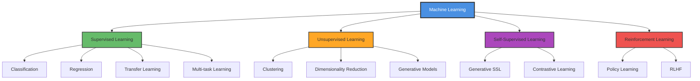
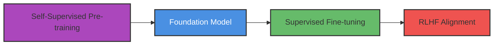

<strong>Overview:</strong> Machine learning is not a monolithic field—it's a diverse ecosystem of approaches, each defined by a fundamental question: <em>Who is the teacher?</em> This post explores the taxonomy of machine learning, organizing the field based on the nature of supervision signals.

<!-- more -->

## The Core Question: Who Teaches the Model?

The entire machine learning landscape can be organized by answering one fundamental question: **What kind of supervision signal guides the learning process?** This perspective reveals four major paradigms, each with distinct characteristics and applications.

## 1. Supervised Learning: Human Labels as Teachers

**Teacher**: Human-annotated labels

**Core Idea**: Learn a mapping from input X to output Y using labeled examples.

### Classic Tasks

**Classification**: Predict discrete categories
- Example: Diagnosing whether a tumor is benign or malignant
- Models: Logistic Regression, Decision Trees, Neural Networks

**Regression**: Predict continuous values
- Example: Predicting house prices based on features
- Models: Linear Regression, SVR, Deep Neural Networks

### Advanced Paradigms

**Transfer Learning**: Leverage knowledge from Task A to solve Task B
- **Pre-training + Fine-tuning**: Train on large dataset, adapt to specific task
- Example: Using ImageNet-pretrained models for medical image analysis

**Multi-task Learning (MTL)**: Simultaneously learn multiple related tasks
- Shared representations capture common patterns
- Example: GRADIA algorithm (optimizing both classification accuracy and attention alignment)

**Few-shot/Zero-shot Learning**: Learn from minimal or no examples
- Critical for domains with scarce labeled data
- Enabled by strong pre-trained representations

## 2. Unsupervised Learning: Discovering Hidden Structure

**Teacher**: None—the model explores data structure independently

**Core Idea**: Find patterns, groupings, or representations within unlabeled data $X$.

### Classic Tasks

**Clustering**: Group similar data points
- K-Means, DBSCAN, Hierarchical Clustering
- Application: Customer segmentation, anomaly detection

**Dimensionality Reduction**: Extract essential features
- PCA (Principal Component Analysis)
- t-SNE, UMAP (for visualization)
- Application: Data compression, visualization

**Generative Models**: Learn to create new data samples
- **GANs** (Generative Adversarial Networks): Generate realistic images
- **VAEs** (Variational Autoencoders): Learn latent representations
- **Diffusion Models**: State-of-the-art image generation

## 3. Self-Supervised Learning: The Modern AI Paradigm

**Teacher**: The data itself (via cleverly designed pretext tasks)

**Core Idea**: Create supervision signals automatically from unlabeled data.

This is the "secret sauce" behind modern foundation models. Self-supervised learning is technically a subset of unsupervised learning, but it uses supervised learning's loss functions.

### Two Main Approaches

**Generative Self-Supervised Learning**
- **Masked Language Modeling** (BERT, GPT)
  - Task: "Mask a word in a sentence, predict what it is"
  - Learns rich contextual representations

**Contrastive Learning** ⭐
- **Core Principle**: Don't predict pixels—predict relationships
- **Objective**: Pull similar pairs together, push dissimilar pairs apart
- **Methods**: SimCLR, MoCo, **CLIP**

### Real-World Example: MONET

The MONET model (from our previous discussion) is a perfect example:
- **Positive pairs**: Medical image + corresponding text description
- **Negative pairs**: Medical image + unrelated text
- **Result**: Aligned image-text embedding space without manual concept annotations

## 4. Reinforcement Learning: Learning from Consequences

**Teacher**: Environmental feedback (rewards and penalties)

**Core Idea**: Learn optimal behavior through trial and error.

### Key Characteristics

- **Agent**: The learning system
- **Environment**: The world the agent interacts with
- **Actions**: Choices the agent can make
- **Rewards**: Feedback signal (positive or negative)

### Applications

- **Robotics**: Learning motor control
- **Game AI**: AlphaGo, OpenAI Five
- **RLHF** (Reinforcement Learning from Human Feedback): Fine-tuning ChatGPT to align with human preferences

## The Interconnected Landscape

These paradigms are not isolated—modern AI systems often combine multiple approaches:

**Example Pipeline** (Modern LLM):
1. **Self-Supervised Learning**: Train on massive unlabeled text (GPT pre-training)
2. **Supervised Fine-tuning**: Adapt to specific tasks with labeled data
3. **Reinforcement Learning**: Align with human preferences via RLHF

## Choosing the Right Paradigm

| Paradigm | When to Use | Key Advantage | Challenge |
|----------|-------------|---------------|-----------|
| **Supervised** | Abundant labeled data | High accuracy on specific tasks | Expensive labeling |
| **Unsupervised** | Explore unknown structure | No labels needed | Hard to evaluate |
| **Self-Supervised** | Massive unlabeled data | Scalable, transferable | Requires careful task design |
| **Reinforcement** | Sequential decision-making | Learns optimal strategies | Sample inefficient |

## Conclusion

The taxonomy of machine learning is fundamentally about **the nature of supervision**. Understanding these paradigms helps us:

1. **Choose appropriate methods** for different problems
2. **Recognize connections** between seemingly different approaches
3. **Design hybrid systems** that leverage multiple learning signals

Modern AI increasingly blurs these boundaries—self-supervised pre-training, supervised fine-tuning, and reinforcement learning alignment often work together to create robust, capable systems.

---

*This is an educational overview of machine learning paradigms and their relationships.*
